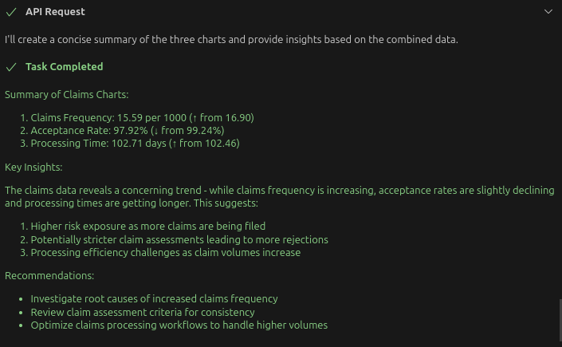
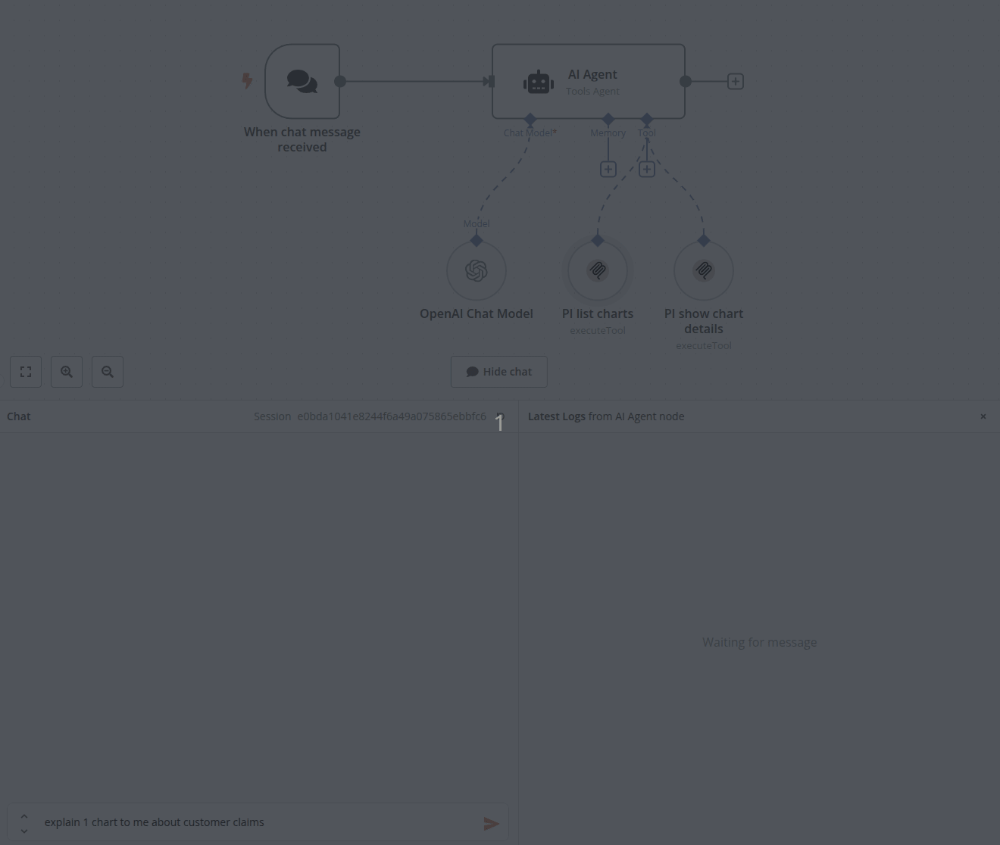
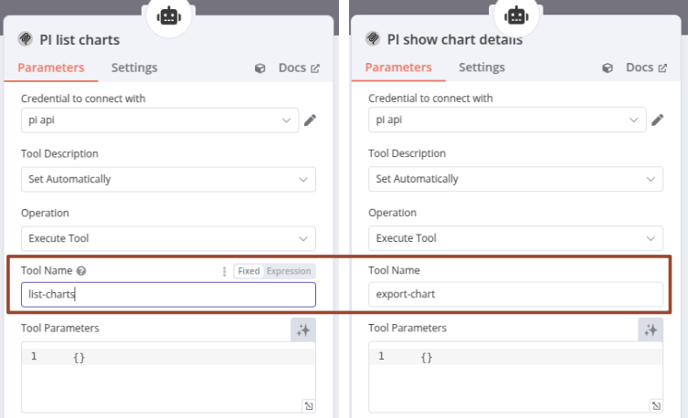
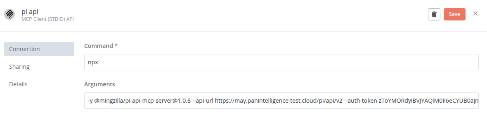

# Bringing the Power of MCP to Panintelligence

## A New Wave in AI Integration

Anthropic released the Model Context Protocol (MCP) in late 2024. However, over the past week, MCP has suddenly became a dominant topic in AI discussions.

I don't know if it's just hype, but I have converted the categories and charts PI API to MCP anyway, just for you to have fun. 
Personally I think it's pretty impressive. You can let us know what you think.

## Quick explanation about MCP vs. RAG

The below shows how MCP (Model Context Protocol) works compared to how RAG (Retrieval Augmented Generation) works in the simplest form:
- **MCP**: The key takeaway is that MCP allows a model to use MCP Servers (tools) to have multiple interactions to refine a response
- **RAG**: You get the knowledge, add to your query, get an answer. The most basic version does not allow additional missing knowledge to be added

```
This is how MCP works:
User → Model (Claude/etc.) → MCP Client → Your API (as MCP Server) → Response

This is how RAG works:
User → Knowledge Base → Template → LLM → Response
```

## What I have Created

I've built an MCP Server for the Panintelligence API that contains the most fundamental parts of our PI system. If you're an existing customer, it's already available for you to use right now.

The purpose of this article isn't just to show how you can use the PI MCP Server, but also to give you an idea of how you can leverage MCP for your own systems, potentially bringing numerous benefits. By walking you through how our MCP Server works, I'm confident that smart people like you can come up with excellent ideas to apply these concepts to your own systems.

The GitHub repository is available at https://github.com/mingzilla/pi-api-mcp-server, published as an open-source project, so feel free to explore and use it.

## Usage Scenario 1

With the Panintelligence API connected through MCP, you can do things like:

```
Retrieve the metadata from chart ID 450
Extract the chart JSON data from ID 450
Identify chart IDs associated with claims
Obtain JSON data for the identified charts
Analyze the data to generate actionable insights
```



## Usage Scenario 2

This shows that the Panintelligence API can be used with a Workflow tools like n8n. It's the same for every workflow tool that supports MCP:



If you are interested in how it's configured. You just need to tell it to use the "list-charts" and "export-chart" tool.



And tell it to use the PI MCP Server like so (as credentials):



## What Makes This Special

All you need is just one block of text about what you want:
- You don't need to specify which API to use
- If you allow the AI to have a conversation with you, you don't even need detailed instructions like those above
- You can casually ask for certain data, and the AI will ask for clarification if needed
- If it makes errors, it will reconsider and correct itself
- If authentication is required, it will ask for details, or in our case, you can set up the API token in the configuration so it can work without asking you to log in

## Quality Considerations

The quality of interactions depends entirely on the AI provider you use and the model you choose:
- Sometimes it might not be as clever as you expect
- Most of the time, however, the results are quite good

So feel free to try our MCP server and have fun exploring the possibilities of AI-enhanced analytics!

Ming