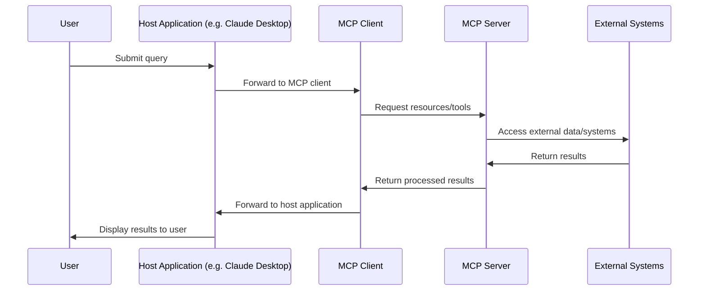
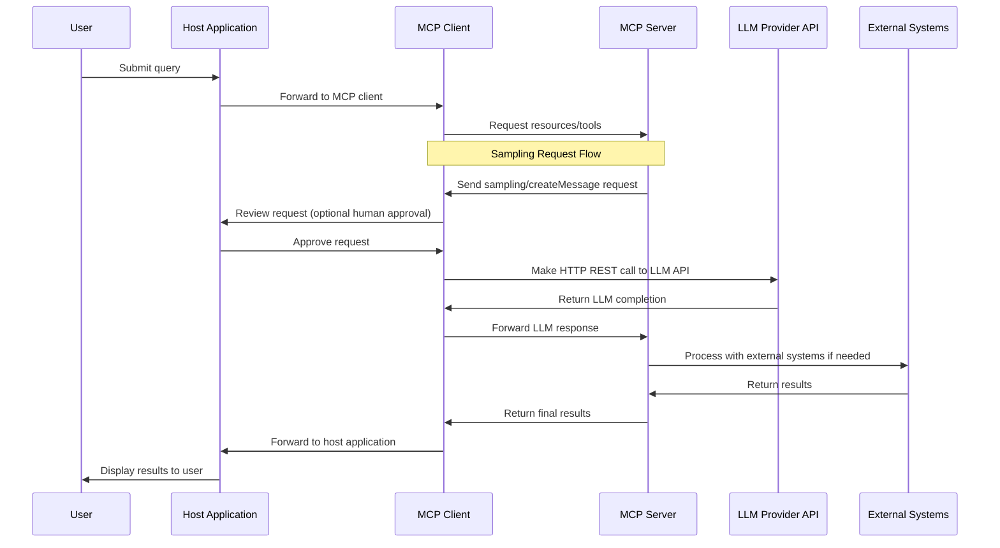

# Understanding MCP Sampling - Enabling Servers to Access LLMs

## Introduction

The Model Context Protocol (MCP) provides a standardized way for applications to interact with Large Language Models (LLMs). While the basic MCP architecture enables clients to communicate with servers that provide tools, resources, and prompts, the **sampling** capability extends this by allowing servers to request LLM completions through the client.

This document explains how MCP communication works, with special focus on how sampling enables MCP servers to make LLM requests via HTTP REST calls.

## Basic MCP Communication Flow

Before diving into sampling, let's understand the standard MCP communication flow:



In this standard flow:
1. The user interacts with a host application
2. The host contains an MCP client that connects to MCP servers
3. MCP servers provide tools, resources, and prompts
4. MCP servers can access external systems but typically cannot directly access LLMs

## What is MCP Sampling?

The name "Sampling" makes absolutely no sense at all! It just means enableCallback! You set up an MCP Client like so:

```java
ClientCapabilities capabilities = ClientCapabilities.builder().sampling().build(); // sampling() means enableCallback()
McpSyncClient client = McpClient.sync(transport)
    .capabilities(capabilities)
    .sampling(request -> { // .sampling(request -> ...) means .executeCallback(request -> ...)
        // call LLM, or Ask user to approve
        return new CreateMessageResult(...)
    });
```

MCP Server does not have access to a LLM. **Sampling** is a capability in MCP that allows servers to call the client (Server sends a `sampling/createMessage` request). 
Since the client has access to a LLM, it gives MCP servers indirect access to LLM capabilities.

## Sampling Communication Flow

When sampling is enabled, the communication flow expands:



## Implementing Sampling with HTTP REST Calls

Here's a practical example of how to implement sampling in your MCP client that will enable servers to make LLM requests through HTTP REST calls:

### Client-Side Implementation

#### TypeScript Example

```typescript
import { Client } from "@modelcontextprotocol/sdk/client/index.js";
import { StdioClientTransport } from "@modelcontextprotocol/sdk/client/stdio.js";
import fetch from "node-fetch";

// Configure client with sampling capability
const client = new Client(
  {
    name: "example-client",
    version: "1.0.0"
  },
  {
    capabilities: {
      sampling: {}  // Enable sampling capability
    }
  }
);

// Set up transport
const transport = new StdioClientTransport({
  command: "node",
  args: ["./server.js"]
});

// Connect to server
await client.connect(transport);

// Set up sampling handler for Claude API
client.setSamplingHandler(async (request) => {
  const response = await fetch("https://api.anthropic.com/v1/messages", {
    method: "POST",
    headers: {
      "Content-Type": "application/json",
      "x-api-key": process.env.ANTHROPIC_API_KEY,
      "anthropic-version": "2023-06-01"
    },
    body: {...}
  });

  const result = await response.json();
  
  return {
    model: result.model,
    stopReason: result.stop_reason,
    role: "assistant",
    content: {
      type: "text",
      text: result.content[0].text
    }
  };
});
```

#### Java Example

```java
ClientCapabilities capabilities = ClientCapabilities.builder().sampling().build();
McpSyncClient client = McpClient.sync(transport)
    .capabilities(capabilities)
    .sampling(request -> {
        try {
            HttpRequest httpRequest = HttpRequest.newBuilder()
                .uri(URI.create("https://api.anthropic.com/v1/messages"))
                .header("Content-Type", "application/json")
                .header("x-api-key", System.getenv("ANTHROPIC_API_KEY"))
                .header("anthropic-version", "2023-06-01")
                .POST(HttpRequest.BodyPublishers.ofString(
                    mapper.writeValueAsString(new HashMap<>(...))))
                .build();
                
            HttpClient httpClient = HttpClient.newHttpClient();
            HttpResponse<String> response = httpClient.send(
                httpRequest, 
                HttpResponse.BodyHandlers.ofString());

            ObjectMapper mapper = new ObjectMapper();
            Map<String, Object> claudeResponse = mapper.readValue(response.body(), new TypeReference<>(){});

            return new CreateMessageResult(
                claudeResponse.get("model").toString(),
                claudeResponse.get("stop_reason").toString(),
                "assistant",
                new TextContent("text", ((Map)((List)claudeResponse.get("content")).get(0)).get("text").toString())
            );
        } catch (Exception e) {
            throw new RuntimeException("Failed to process sampling request", e);
        }
    })
    .build();
```

### Server-Side Usage

With sampling enabled in the client, MCP servers can now request LLM completions:

```typescript
// In your MCP server implementation
server.tool(
  "generate-analysis",
  { data: z.string() },
  async ({ data }) => {
    // Prepare context for the LLM
    const messages = [
      {
        role: "user",
        content: {
          type: "text",
          text: `Please analyze this data and provide insights: ${data}`
        }
      }
    ];
    
    // Request LLM analysis through sampling
    const result = await server.createMessage({
      messages,
      maxTokens: 1000,
      temperature: 0.3,
      includeContext: "thisServer"  // Include relevant context from this server
    });
    
    // Return the LLM's analysis
    return {
      content: [
        {
          type: "text",
          text: `Analysis results: ${result.content.text}`
        }
      ]
    };
  }
);
```

## Security Considerations

When implementing sampling, consider these security practices:

1. **Review all sampling requests** before processing them
2. **Don't expose API keys** in client-side code
3. **Set appropriate limits** on token usage and rate
4. **Validate and sanitize** all inputs before sending to LLM
5. **Implement human approval** for sensitive operations
6. **Log all sampling requests** for auditing
7. **Set clear boundaries** on what data can be included
8. **Use context controls** to limit information exposure

## Best Practices

1. **Error handling**: Properly handle API errors and timeouts
2. **Caching**: Consider caching similar LLM requests to reduce costs
3. **Cost management**: Track token usage and implement cost controls
4. **Fallbacks**: Provide graceful degradation if sampling fails
5. **Context management**: Be mindful of context window limitations
6. **Model selection**: Choose appropriate models based on task requirements
7. **Progressive disclosure**: Only reveal sampling capability when needed
